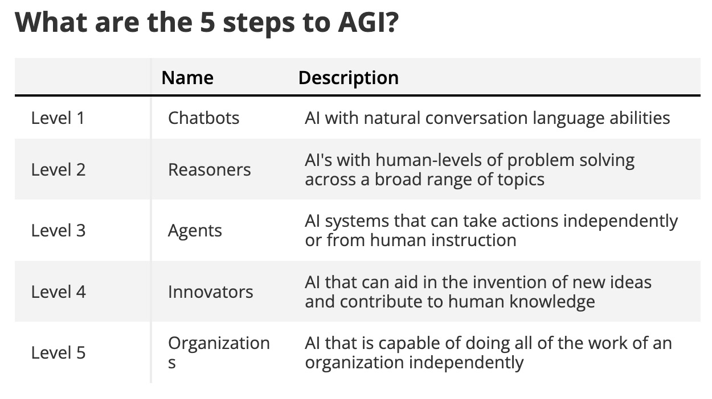

# Artificial General Intelligence (AGI)

**Artificial General Intelligence (AGI)** refers to a type of artificial intelligence that possesses the ability to understand, learn, and apply knowledge across a wide range of tasks at a level comparable to human intelligence. Unlike narrow AI, which is designed to perform specific tasks (e.g., facial recognition, language translation), AGI aims to exhibit flexible and generalized cognitive abilities.

[Watch: Ilya Sutskever of OpenAI | AI will have a human brain that can think for itself](https://www.youtube.com/watch?v=Co2EQugAHYU)

### Key Characteristics of AGI

1. **Generalization:** AGI can apply knowledge learned from one domain to various other domains without requiring specific training for each new task.
2. **Adaptability:** It can adapt to new and unforeseen situations by leveraging its broad knowledge base and cognitive abilities.
3. **Understanding:** AGI can comprehend complex concepts and ideas similarly to how humans do, enabling it to make sense of abstract and nuanced information.
4. **Learning:** It has the capability to learn and improve from experiences, data, and interactions over time, just like a human being.

### Examples of AGI (Hypothetical)

1. **Universal Personal Assistant:** An AGI-powered personal assistant would not only schedule meetings or set reminders but also understand and participate in complex discussions, offer advice on diverse topics like legal issues, medical conditions, or emotional support, and learn from interactions to better assist the user over time.

2. **Autonomous Scientist:** An AGI could independently conduct scientific research by formulating hypotheses, designing and performing experiments, analyzing data, and making discoveries across various fields of science. For instance, it could work on developing new materials, finding cures for diseases, and even solving theoretical problems in physics.

3. **Multilingual Translator and Cultural Advisor:** Beyond simple translation, an AGI could understand and convey cultural nuances, historical contexts, and idiomatic expressions in any language. It could serve as a cultural bridge in diplomatic negotiations or as a comprehensive guide for international businesses.

4. **Adaptive Educator:** An AGI-based education system could tailor its teaching methods to individual learning styles, provide personalized feedback, create unique educational content, and tutor students in any subject, from basic arithmetic to advanced quantum mechanics.

### Current State and Challenges

As of now, AGI does not exist. Current AI systems, including advanced models like OpenAI's GPT-4o (Generative Pre-trained Transformer 4 Omini), are examples of narrow AI. They excel at specific tasks they were trained on but lack the generalized cognitive abilities of AGI. Some key challenges in achieving AGI include:

- **Computational Power:** AGI will require immense computational resources to process and integrate vast amounts of data in real time.
- **Algorithmic Complexity:** Developing algorithms that can replicate human-like understanding, learning, and adaptability is a significant challenge.
- **Ethical and Safety Concerns:** Ensuring that AGI systems are safe, ethical, and aligned with human values is crucial to prevent unintended consequences.

### Progress Towards AGI

Several research initiatives and organizations are working towards AGI:

- **OpenAI:** Known for developing advanced language models, OpenAI is actively researching general AI capabilities and safety measures.
- **DeepMind:** A subsidiary of Alphabet Inc., DeepMind is focused on creating AI systems with general intelligence, evidenced by its work on reinforcement learning and neural networks.
- **IBM Watson:** Initially designed for narrow AI applications like healthcare and customer service, IBM Watson's research is expanding towards more generalized AI capabilities.

### Conclusion

AGI represents a significant leap from current AI technologies, aiming to create machines that can think, learn, and adapt like humans. While still theoretical, AGI promises transformative impacts across all sectors of society, raising both exciting opportunities and complex challenges. The journey to AGI involves addressing fundamental questions about intelligence, consciousness, and the ethical implications of creating such powerful systems.

# Five Steps to Reach Superintelligence

.

OpenAI has 5 steps to reach AGI and we're only just moving towards step two — the creation of "reasoners". These are models capable of performing problem-solving tasks as well as a human with a PhD and no access to a textbook.

[OpenAI outlines plan for AGI — 5 steps to reach superintelligence](https://www.tomsguide.com/ai/chatgpt/openai-has-5-steps-to-agi-and-were-only-a-third-of-the-way-there)

OpenAI has proposed a roadmap with **five levels** to track progress toward building **Artificial General Intelligence (AGI)**:

Level 1. **Chatbots**:

    - AI with conversational language capabilities.
    - Examples: ChatGPT, virtual assistants.

The first of the five levels is for “Chatbots,” or “AI with conversational language”. This was achieved with GPT-3.5 in the first version of ChatGPT and was largely possible even before that, just not as effectively or with as much of a natural conversation.

Compare having a conversation with Siri or Alexa to that of ChatGPT or Gemini — it is night and day and this is because the latter is a conversational AI.

Large natively multimodal models like GPT-4o, Gemini Pro 1.5 or Claude Sonnet 3.5 are at the top end of this level and are the first of the ‘frontier’ grade AIs. They are capable of complex, multi-threaded conversations, have memory and can do some limited reasoning. 

Level 2. **Reasoners**:

    - AI with human-level problem-solving abilities.
    - Comparable to a human with a PhD, even without access to textbooks.
    - We're currently moving toward this level.
    - Next-gen models like GPT-5 are expected to achieve this.

Level 2 AIs are the reasoners. OpenAI says these are capable of “human-level problem solving,” across a broad range of areas, not specific to one or two tasks. 

Many of the frontier models have human-level problem-solving on specific tasks, but none have achieved that on a general, broad level without very specific prompting and data input.

In the same way that GPT-3.5 was at the start of level 1, the start of level 2 could be achieved this year with the mid-tier models. OpenAI is expected to release GPT-4.5 (or something along those lines) by the end of the year and with it improvements in reasoning.

Meanwhile, Anthropic is expected to launch Claude Opus 3.5 in the coming months — this is the big brother to the impressive Claude 3.5 Sonnet and we’re still waiting on Google’s Gemini Ultra 1.5. This is the largest version of the Gemini model family.
    
Level 3. **Agents**:

    - Systems capable of taking actions on behalf of users.
    - Enables real-world, unsupervised decision-making.
    - Use cases: Driverless vehicles, autonomous robots, personal assistants.

Level 3 is when the AI models begin to develop the ability to create content or perform actions without human input, or at least at the general direction of humans. Sam Altman, OpenAI CEO has previously hinted that GPT-5 might be an agent-based AI system. 

There are a number of companies building agentic systems including Devin, the AI software engineer from Cognition, but these use existing models, clever prompting and set instructions rather than being something the AI can do natively on its own.

Level 4. **Innovators**:

    - AI that aids in invention and discovery.
    - Creative problem-solving and novel solutions.
    - Pushing the boundaries of what's possible.

Level 4 is where the AI becomes more innovative and capable of "aiding in invention". This could be where AI adds to the sum of human knowledge rather than simply draws from what has already been created or shared. 

If you ask an AI to create a new language, without giving it specific words it will give you a version of Esperanto today, in the future, it could build it from scratch. 

OpenAI has a new partnership with the Los Alamos National Laboratory to develop AI-based bioscience research. This is more immediate in the fact they want to create safe ways to use AI in a lab setting, but will also likely help formulate plans for when AI can invent its own creations.

Level 5. **Organizations**:

    - AI that can perform work at an organizational scale.
    - Handling complex tasks across various domains.
    - Integration into business processes.

The final stage, and the point where AGI can be said to be reached is when an AI model is capable of running an entire organization on its own without human input. 

To achieve this level of capability it needs to have all the abilities and skills of the previous stages plus broad intelligence. To run an organization it would need to be able to understand all the independent parts and how they work together.

Altman has previously said we could achieve AGI this decade. If he’s correct then instead of voting for an octogenarian in 2028 we might be bowing down to Skynet.

Remember, AGI represents a level of intelligence surpassing humans across all tasks. While progress is being made, achieving true AGI remains a challenging endeavor!

## OpenAI's 'Strawberry' AI: The Future of Advanced Reasoning Unveiled

[Watch: STRAWBERRY: OpenAI's MOST POWERFULL AI Ever With Human-Level Reasoning](https://www.youtube.com/watch?v=TOFb8YMPTnE)

[Exclusive: OpenAI working on new reasoning technology under code name ‘Strawberry’](https://www.reuters.com/technology/artificial-intelligence/openai-working-new-reasoning-technology-under-code-name-strawberry-2024-07-12/)

OpenAI's "Strawberry" project is an exciting endeavor aimed at enhancing the reasoning capabilities of artificial intelligence (AI) models. Let me break it down for you:

1. **Reasoning Engine**:
   - A reasoning engine is an AI system designed to perform logical thinking, infer relationships, and draw conclusions based on available information.
   - It enables AI models to process complex data, make informed decisions, and solve problems by following logical rules and patterns.

2. **Project Strawberry**:
   - OpenAI's Strawberry project is a research initiative focused on advancing AI reasoning skills.
   - The goal is to create AI models that can think and understand the world more like humans do, improving their ability to learn, adapt, and solve problems.

3. **Key Aspects of Strawberry**:
   - **Advanced Reasoning**: Strawberry aims to go beyond simple question-answering. It focuses on deep research and autonomous reasoning, allowing AI to explore complex topics independently.
   - **Human-Like Abilities**: By addressing challenges related to logical thinking and planning, Strawberry could lead to significant scientific breakthroughs.
   - **Autonomous Exploration**: The project enables AI to navigate the internet autonomously, conducting in-depth research without human prompts.

4. **Significance**:
   - Reasoning is a crucial component for achieving Artificial General Intelligence (AGI), which can perform tasks across a wide range of domains.
   - Strawberry represents a significant step toward AGI by enhancing AI's reasoning capabilities.

In summary, OpenAI's Strawberry project aims to create AI models with advanced reasoning skills, bridging the gap between current AI capabilities and human-like understanding. 🍓¹²³⁴

Sources:
(1) What we know about OpenAI's secretive 'Project Strawberry'. https://www.newsweek.com/openai-strawberry-chat-gpt-ai-sam-altman-1925960.
(2) OpenAI's 'Strawberry' AI model aims for advanced reasoning. https://readwrite.com/openai-strawberry-ai-advanced-research-reasoning/.
(3) STRAWBERRY: OpenAI's MOST POWERFULL AI Ever With Human-Level Reasoning. https://www.chaindesk.ai/tools/youtube-summarizer/strawberry-open-ais-most-powerfull-ai-ever-with-human-level-reasoning-TOFb8YMPTnE.
(4) OpenAI’s ‘Strawberry’ project advances AI reasoning. https://btw.media/tech-trends/openais-strawberry-project-advances-ai-reasoning/.

### What is Deep Research in Project Strawberry?

The concept of "deep research" in OpenAI's Project Strawberry goes beyond simple information retrieval or question answering. Here's what it entails:

1. **Formulating Complex Queries**:
   - Strawberry models actively create intricate queries to explore specific topics or questions.
   - Unlike basic keyword searches, deep research involves crafting nuanced queries that consider context and intent.

2. **Autonomous Information Retrieval**:
   - Strawberry autonomously scours the internet for relevant information.
   - It doesn't rely solely on pre-existing knowledge but dynamically fetches up-to-date data from diverse sources.

3. **Synthesizing Insights**:
   - The model synthesizes findings from multiple sources.
   - It combines information to draw insightful conclusions, similar to how human experts analyze data.

4. **Real-Time Exploration**:
   - Strawberry's ability to navigate the web autonomously is crucial.
   - It accesses current information, making it valuable for scientific research, market analysis, education, and more.

In essence, Project Strawberry aims to create AI models capable of conducting research at a level approaching human experts, bridging the gap between narrow AI and more general intelligence. 🍓¹²³⁴

Sources:
(1) What is OpenAI's 'Strawberry Model'? - Unite.AI. https://www.unite.ai/what-is-openais-strawberry-model/.
(2) Deep Learning in Strawberry Growth Monitoring Research: A Review - Springer. https://link.springer.com/chapter/10.1007/978-3-031-53404-1_7.
(3) OpenAI’s project ‘Strawberry’ could power AI with super-human .... https://www.fastcompany.com/91156102/how-openais-secret-project-strawberry-could-power-ai-super-human-level-intelligence.
(4) OpenAI's hush project 'Strawberry' to give AI models ... - Cybernews. https://cybernews.com/ai-news/openai-project-strawberry-ai-model-reasoning-skills/.

### How will Project Strawberry help us in achieving AGI?

Project Strawberry plays a pivotal role in advancing toward Artificial General Intelligence (AGI) by addressing critical aspects:

1. **Reasoning Skills Enhancement**:
   - Strawberry aims to create AI models with advanced reasoning abilities.
   - Improved reasoning is essential for AGI, allowing models to understand context, infer relationships, and make informed decisions.

2. **Autonomous Exploration**:
   - Strawberry autonomously explores the internet, gathering up-to-date information.
   - AGI requires models to learn independently, adapt, and explore new domains—a capability Strawberry fosters.

3. **Complex Problem Solving**:
   - AGI must tackle multifaceted problems across diverse domains.
   - Strawberry's deep research enables models to synthesize insights and solve complex challenges.

4. **Bridge to Human-Like Understanding**:
   - By enhancing reasoning, Strawberry narrows the gap between narrow AI and AGI.
   - Achieving AGI involves models that think more like humans, and Strawberry contributes to this goal.

In summary, Project Strawberry propels us toward AGI by empowering AI with reasoning, exploration, and problem-solving abilities. 🍓

