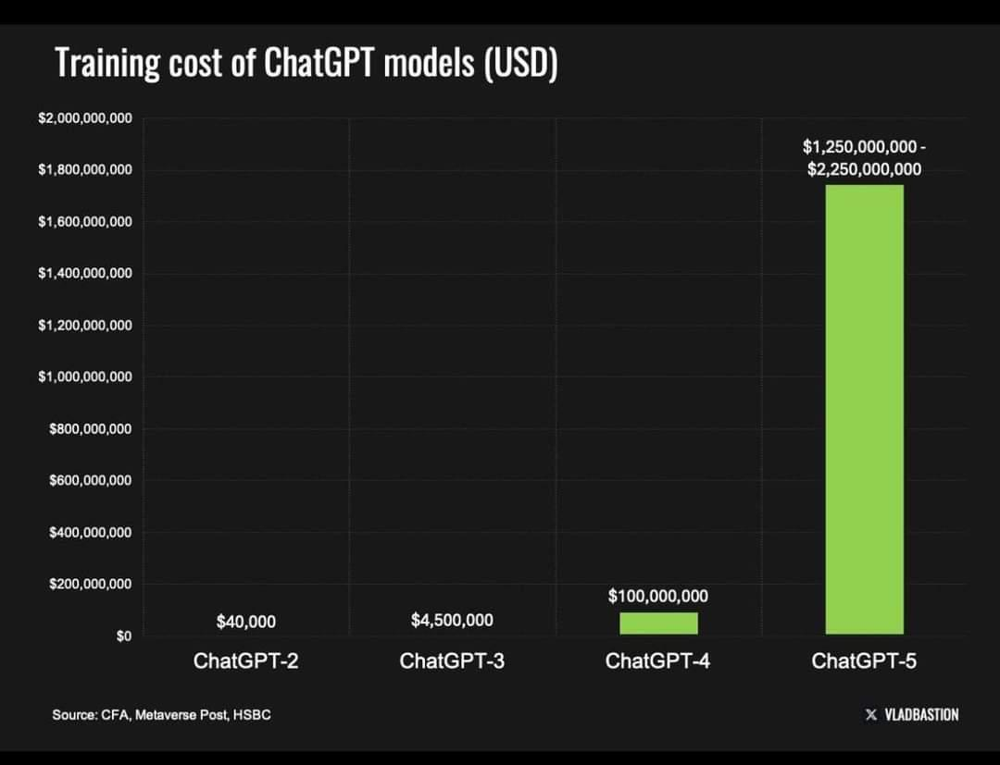

# Applied Generative AI

Applied Generative AI refers to the utilization of generative AI models to address practical problems and create tangible value across various industries. This field involves leveraging pre-existing large language models (LLMs) and other generative AI technologies, fine-tuning them for specific use cases, and integrating them into applications to automate tasks, enhance productivity, and drive innovation. 

### Applied Generative AI in the Current Era

In the current era, only a handful of companies have the resources and expertise to develop large language models (LLMs) from scratch. Instead, most developers and businesses are focusing on using these LLMs as foundation models. They fine-tune these models to suit specific needs and build applications that capitalize on their generative capabilities. Examples of these applications include chatbots, content generators, recommendation systems, and automated customer support tools.

[Watch: AI supercomputer ‘Stargate’: $100 billion Plan of Microsoft and ChatGPT](https://www.youtube.com/watch?app=desktop&v=tBtVirWAL8w)

### Reasons Why Developing LLMs from Scratch is Not Feasible for Most

1. **High Computational Requirements**:
   - **Massive Data Processing**: Training an LLM requires processing vast amounts of data. This demands high-performance computing resources, often involving thousands of GPUs working in parallel.
   - **Energy Consumption**: The energy consumption for training these models is substantial, leading to significant operational costs. For instance, training GPT-3 reportedly required tens of megawatt-hours of electricity.

2. **Enormous Costs**:
   - **Infrastructure**: Setting up and maintaining the necessary infrastructure, including data centers with specialized hardware (like GPUs or TPUs), is prohibitively expensive for most organizations.
   - **Operational Costs**: Beyond the initial setup, ongoing costs for electricity, cooling, and hardware maintenance add to the financial burden.
   - **[AI models that cost $1 billion to train are underway, $100 billion models coming — largest current models take 'only' $100 million to train: Anthropic CEO](https://www.tomshardware.com/tech-industry/artificial-intelligence/ai-models-that-cost-dollar1-billion-to-train-are-in-development-dollar100-billion-models-coming-soon-largest-current-models-take-only-dollar100-million-to-train-anthropic-ceo)

.

3. **Extensive Expertise**:
   - **Specialized Knowledge**: Developing LLMs from scratch requires expertise in various domains, including machine learning, natural language processing, data engineering, and distributed computing.
   - **Research and Development**: Staying at the cutting edge of AI research necessitates a team of highly skilled researchers and engineers who can innovate and improve upon existing models.

4. **Data Requirements**:
   - **Quality and Quantity**: Training an effective LLM requires not only vast quantities of data but also high-quality, diverse datasets. Collecting, cleaning, and curating such datasets is a major challenge.
   - **Ethical and Legal Issues**: Handling large datasets also involves navigating complex ethical and legal issues related to data privacy and bias.

5. **Time and Iteration**:
   - **Long Training Times**: Training large models can take weeks or even months. This extended timeline makes it difficult for most organizations to iterate and improve their models rapidly.
   - **Fine-Tuning and Testing**: Even after initial training, significant time is needed for fine-tuning and rigorous testing to ensure the model performs well in real-world applications.

6. **Maintenance and Updates**:
   - **Ongoing Maintenance**: Post-deployment, LLMs require regular updates and maintenance to address issues such as data drift, where the statistical properties of input data change over time.
   - **Security and Compliance**: Ensuring that the models remain secure and compliant with evolving regulations requires continuous effort and resources.

### Practical Approach: Fine-Tuning and Application Development

Given these challenges, the practical approach for most developers and businesses is to use pre-trained LLMs provided by major AI research organizations and tech companies. These foundation models can be fine-tuned using transfer learning techniques to adapt them to specific tasks, leveraging the existing robust capabilities of the LLMs without incurring the prohibitive costs and efforts of developing them from scratch. This approach enables:

- **Rapid Deployment**: Quickly bringing AI-driven applications to market.
- **Customization**: Tailoring models to specific domains or business needs with relatively less computational power and time.
- **Cost Efficiency**: Significantly reducing the financial burden compared to training LLMs from scratch.

By focusing on fine-tuning and building applications, developers can harness the power of generative AI to create innovative solutions that drive value and efficiency across various sectors.

## What is Prompt Engineering?

Prompt engineering is a technique used to design and refine the input prompts given to generative AI models, like GPT-4o, to produce desired outputs. The prompt is the initial text or question fed to the model, and its quality and structure significantly influence the model's responses. 

### Role in Generative AI

1. **Guiding Outputs**:
   - Well-crafted prompts can guide the AI to generate more accurate, relevant, and coherent responses. They set the context and provide the necessary information for the AI to understand what is being asked.

2. **Reducing Ambiguity**:
   - Clear and specific prompts reduce the chances of ambiguous or irrelevant answers. This is particularly important in complex tasks where precision is required.

3. **Enhancing Creativity**:
   - In creative applications like story writing, art generation, or idea brainstorming, prompts can spark the AI's creativity and lead to novel outputs that align with the user's vision.

4. **Improving Efficiency**:
   - Effective prompt engineering can save time and computational resources by reducing the need for multiple iterations and adjustments to get the desired output.

5. **Customizing Responses**:
   - For applications where personalized or domain-specific information is needed, prompt engineering helps tailor the AI’s responses to meet specific requirements, such as legal advice, medical information, or technical support.

6. **Facilitating Fine-Tuning**:
   - In scenarios where AI models are fine-tuned for specific tasks or industries, prompt engineering plays a crucial role in creating datasets that align with the desired outcomes during the training process.

### Techniques in Prompt Engineering

1. **Iterative Refinement**:
   - Continuously refining and tweaking prompts based on the model’s responses to achieve the most effective results.

2. **Context Setting**:
   - Providing enough context in the prompt to ensure the model understands the background and specifics of the task.

3. **Using Examples**:
   - Including examples of desired outputs within the prompt to guide the AI towards the expected type of response.

4. **Prompt Length**:
   - Balancing the length of the prompt to be informative without overwhelming the model, ensuring conciseness while maintaining clarity.

5. **Structured Prompts**:
   - Utilizing structured formats such as question-answer pairs, bullet points, or formatted text to guide the model more effectively.

### Applications in Various Domains

- **Business**: Automating customer service, generating business reports, and summarizing meetings.
- **Healthcare**: Providing medical information, assisting in diagnostics, and generating patient reports.
- **Education**: Creating educational content, tutoring, and providing personalized learning experiences.
- **Creative Arts**: Writing stories, generating visual art, composing music, and developing game content.
- **Research**: Summarizing academic papers, generating hypotheses, and assisting in data analysis.

In summary, prompt engineering is a critical aspect of working with generative AI, enabling more accurate, relevant, and creative outputs across various applications.