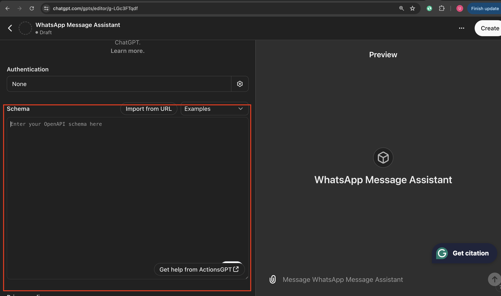
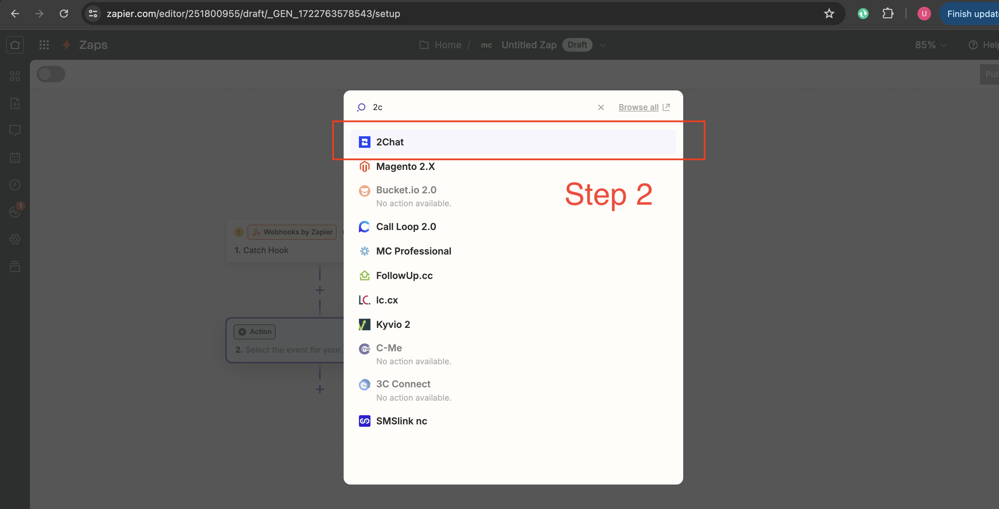
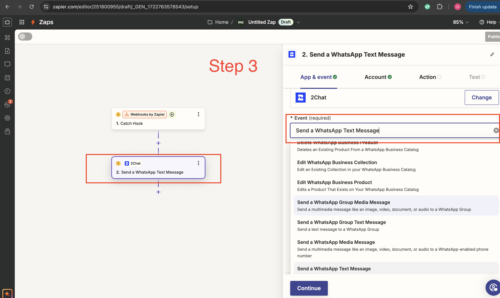
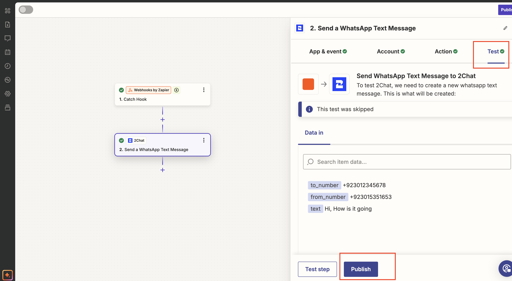

# Custom GPT to Send WhatsApp Messages with Zapier


In today’s digital age, instant communication is vital. WhatsApp, with its vast user base, has become a preferred communication tool for many businesses and individuals. 

In this, I’ll guide you through the process of creating a custom GPT that sends WhatsApp messages to both individuals and groups using Zapier and 2Chat. This powerful integration will enable seamless and automated messaging, enhancing your communication capabilities.


## Why Use Custom GPT for WhatsApp Messaging?

Custom GPTs, powered by OpenAI’s technology, provide a flexible and intelligent way to handle various tasks. Integrating a custom GPT with WhatsApp allows you to automate messages, provide instant responses, and manage group communications efficiently. This setup is handy for businesses looking to improve customer service, send reminders, or manage group communications.

## Prerequisites

Before we dive into the process, ensure you have the following:

	1.	ChatGPT Plus Account: To access and create your custom GPT.
	2.	Zapier Account: To automate workflows and connect different apps.
	3.	2Chat Account: To handle WhatsApp messaging.
	4.	Basic Knowledge of Python: To write some basic scripts.

---

# 1. Setting Up Your Custom GPT
To begin setting up your custom GPT, follow these steps:

1. Log in to Your ChatGPT Plus Account:
 - Open your web browser and navigate to https://chatgpt.com/
 - Log in using your GPT-4 Plus account credentials.

2. Access the Custom GPTs Section
Once logged in, click on your profile avatar icon located in the top-right corner of the page.
From the dropdown menu, select the “My GPTs” option.


3. Create a New GPT:
 - Click on the “Create a GPT” option.
 - You will be redirected to the GPT editor at https://chatgpt.com/gpts/editor.

5. Configure Your Custom GPT:
   - **Name** Your GPT: Enter a meaningful name for your custom GPT, such as “WhatsApp Message Assistant”.
   - **Description:** Provide a brief description of your GPT’s purpose. For example, “Send inbox WhatsApp messages to individuals.”
   - **Instructions:** Define clear instructions for your GPT. This could include specific prompts or guidelines to ensure the generated messages meet your requirements
For instance, you might add:
	
 `You are a custom GPT designed to send messages to my WhatsApp inbox through Zapier. This GPT will call a Zapier webhook and send data to that webhook, including the recipient's phone number and the message to be sent.`

---

# 2. Setting Up Zapier for Integration

After configuring your custom GPT, the next step is to set up Zapier to automate the process of sending WhatsApp messages. Follow these steps:

 - Sign Up on Zapier: https://zapier.com/
 - Open the Zapier Dashboard: This is where you can create and manage your Zaps (automated workflows).
 - Open Zaps tab: located at the left menu.


---

- #### Create a New Zap: Click on the “Create” button, this will start the process of creating a new automated workflow.
  


---

#### Once new Zap windows open then you have two options on screen first one will be Trigger and the second will be Action


---

### Configure the Trigger:
 - In the “Choose App & Event” section, select the app that will trigger the workflow. For example, you might choose “Webhook” if you’re triggering the workflow via a webhook from your custom GPT.
 - Event: Select the event that will trigger the Zap. For webhooks, you can select “Catch Hook” to capture data sent to a unique URL.
 - Click “Continue” and follow the instructions to set up and test your trigger.
 - copy this URL your GPT will use this to call your Zaiper's Zap

<p align="center">
  1
  
  2

</p>

  
**NOTE:** Before customizing the message, make sure to call your webhook at least once from ChatGPT with an object that contains the recipient’s phone number and the text message to be sent. This will help to customize the message step in the next action.


#### If you test with custom GPT, then integrate GPT with Zapier:
 - Go to the custom GPT screen in ChatGPT.
 - Click on the “Create New Action” button. This will open a new screen.
 - Paste your Zapier webhook schema with the desired webhook input parameters.

<p align="center">
  

</p>


**Here is the schema**

```
{
  "openapi": "3.1.0",
  "info": {
    "title": "Zapier Webhook Integration",
    "description": "OpenAPI specification for POSTing to a Zapier webhook",
    "version": "v1.0.0"
  },
  "servers": [
    {
      "url": "https://hooks.zapier.com"
    }
  ],
  "paths": {
    "/hooks/catch/ here enter your path with ID": {
      "post": {
        "operationId": "Send Data",
        "summary": "Post Data to Zapier Webhook",
        "description": "This endpoint is used to send data to the specified Zapier webhook.",
        "requestBody": {
          "description": "Data to be sent to the webhook",
          "required": true,
          "content": {
            "application/json": {
              "schema": {
                "$ref": "#/components/schemas/WebhookData"
              }
            }
          }
        },
        "responses": {
          "200": {
            "description": "Successful response"
          },
          "default": {
            "description": "Unexpected error"
          }
        }
      }
    }
  },
  "components": {
    "schemas": {
      "WebhookData": {
        "type": "object",
        "properties": {
          "message": {
            "type": "string",
            "description": "type Message here"
          },
          "phoneNumber": {
            "type": "string",
            "description": "phone number"
          },
          "name": {
            "type": "string",
            "description": "Name of recipient"
          }
        },
        "required": [
          "message",
          "phoneNumber"
        ]
      }
    }
  }
}
```

---

Once you call this webhook from GPT, you’ll receive values in your webhook similar to the example images provided

<p align="center">
  

</p>

- before setting the next action on Zaiper you have to set up your 2chat account

---

#  3. Setting Up Your 2Chat Account
 - Sign Up on 2Chat  https://app.2chat.io/
 - Open the 2Chat Dashboard
 - Click on the “Channels” tab in the dashboard


- Enter Your WhatsApp Number and Name: Provide your WhatsApp number and a name for the channel.
- Press Add and Connect: Click the “Add and Connect” button to proceed.
- Scan QR Code: 2Chat will display a QR code. Open WhatsApp on your phone, go to the settings menu, select “Linked Devices,” and scan the QR code to connect your WhatsApp with 2Chat.


### Obtain Your API Key:
 - Access Your Profile: Click on your profile avatar icon in 2Chat.
 - Open Profile Page: Navigate to the profile page.
 - API Access Tab: Click on the “API Access” tab.
 - Get API Key: Here, you will find your API key, which will be used to integrate 2Chat with Zapier.

<p align="center">
  1
  
	
  2

</p>

---

# 4. Integrate 2Chat with Zapier

Now that you have obtained your API key from 2Chat, you can integrate 2Chat with Zapier and configure the action to send WhatsApp messages. Follow these steps:

 - **Add Action in Zapier:**
   Go back to your Zapier dashboard where you created the new Zap.
 - **Select 2Chat as the Action App:**
   In the “Action” section of your Zap, click on the “Choose App & Event” field.
   Search for “2Chat” and select it from the list of available apps.
 - **Configure the 2Chat Action:**
Choose Action Event: After selecting 2Chat, you will be prompted to choose an action event.
Select “Send Text Message” as the action event.

<p align="center">
  
	


</p>

 - **Connect Your 2Chat Account:**
- Click on “Sign in to 2Chat” to connect your 2Chat account with Zapier.

 
  
  ---
   
- When prompted, enter the API key you obtained from the 2Chat profile page.


- **Customize the Message:**

   - Recipient Phone Number: Map the recipient’s phone number from the trigger data (e.g., data captured by your custom GPT in webhook).
 


   - “From” phone number will be picked by your connected 2Chat account,
   - Message Content: Map the message content generated by your custom GPT.

     
     
   - Ensure that the data fields are correctly mapped to send the message to the intended recipient.

- **Test the Action:**
  Zapier will prompt you to test the action to ensure that everything is set up correctly. Follow the instructions to send a test message using 2Chat.
  Review the test message to ensure it was delivered successfully and contains the correct content.




- **Activate Your Zap:**
  - Once the action is configured correctly and the test was successful, click “Publish Zap” to activate it.


---

# 5. Publish and Use Your Custom GPT

After setting up and integrating your custom GPT with Zapier and 2Chat, the final step is to publish your custom GPT and test it by sending a message. Follow these steps:

Publish Your Custom GPT:
   - Go back to the custom GPT screen in ChatGPT.
   - Review all the settings, instructions, and configurations to ensure everything is correctly set up.
   - Click on the “Publish” button to make your custom GPT live.
Test Your Custom GPT:
   - Once your GPT is published, it’s time to test it by sending a message.
   - Provide a prompt to your custom GPT that includes the message content and the recipient’s phone number. For example:

 ```
Send a message to +1234567890 saying "Hello, this is a test message from my custom GPT!"
```
