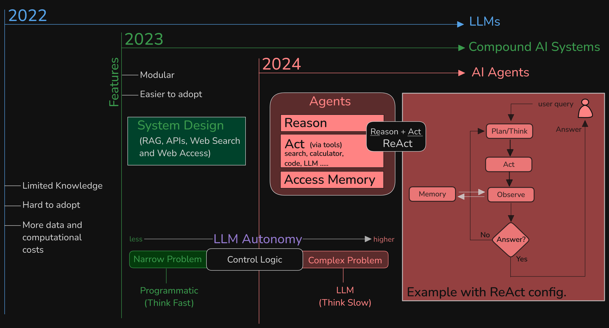

# Compound AI Systems: A New Frontier in AI

[The Shift from Models to Compound AI Systems](https://bair.berkeley.edu/blog/2024/02/18/compound-ai-systems/)

[Watch: The Future of AI: Unleashing the Power of Compound Systems](https://www.youtube.com/watch?v=5QIpc6hKaKg)

[Watch: The Shift from Large Language Models(LLMs) to Compound AI Systems](https://www.youtube.com/watch?v=IaMOZq1O7JI)

[What Are Compound AI Systems?](https://www.databricks.com/glossary/compound-ai-systems)

[Why Compound AI Systems is the Future of Complex Problem-Solving](https://ashishjaiman.medium.com/why-a-compound-ai-systems-is-the-future-of-complex-problem-solving-bd7be16ed57f)

**Compound AI systems** represent a significant shift in the way we approach AI development. Instead of relying on a single, monolithic model, these systems combine multiple AI models, tools, and techniques to create more robust, flexible, and efficient solutions to complex problems.

Compound AI systems are an emerging trend in artificial intelligence that involve integrating multiple AI components to tackle complex tasks more effectively. Unlike traditional AI models that rely on a single model, compound AI systems combine various models, retrievers, databases, and external tools to enhance performance, flexibility, and robustness¹².

This approach allows for better performance by leveraging the strengths of individual components, making the systems more adaptable and resilient. It's a significant shift from focusing solely on scaling up models to strategically assembling multi-component systems.

### Why Compound AI is Gaining Traction:

* **Overcoming limitations of single models:** Single models often struggle with complex, real-world problems. Compound AI systems address this by breaking down problems into smaller, manageable components.
* **Improved efficiency and resource utilization:** By specializing different components, compound AI systems can optimize resource usage and reduce computational costs.
* **Increased flexibility and scalability:** The modular architecture allows for easy integration of new models and components, making the system adaptable to changing requirements.

### Real-World Applications:

The potential applications of compound AI systems are vast and span across various industries:

* **Healthcare:** Drug discovery, medical image analysis, personalized treatment plans
* **Finance:** Fraud detection, risk assessment, algorithmic trading
* **Autonomous vehicles:** Perception, decision-making, control
* **Natural language processing:** Advanced chatbots, language translation, sentiment analysis

**In essence, compound AI systems mark a paradigm shift in AI development, promising to deliver more sophisticated, reliable, and effective solutions to a wide range of challenges.**

## LLMs -> Compound AI Systems -> AI Agents

**We are witnessing a shift from LLMs to compound AI systems, and eventually, to [AI agents](https://www.youtube.com/watch?v=F8NKVhkZZWI).**

Here's a breakdown of this evolution:

### From LLMs to Compound AI Systems
* **LLMs** are incredibly powerful at generating text, but they often lack real-world grounding and can be prone to hallucinations.
* **Compound AI systems** address these limitations by combining LLMs with other AI components like knowledge graphs, reasoning engines, and perception modules. This creates more robust and reliable systems capable of handling complex tasks.

### From Compound AI Systems to [AI Agents](https://www.youtube.com/watch?v=F8NKVhkZZWI)
* **AI agents** take this concept a step further by giving AI systems the ability to act autonomously in the real world or simulated environments. They can set goals, plan actions, and learn from their experiences. 
* **Compound AI systems** form the core of many AI agents, providing the intelligence and decision-making capabilities.

**This progression is driven by the increasing complexity of the problems we want AI to solve.** As we move towards more sophisticated applications, we need AI systems that can understand, reason, and act in the world, not just generate text.

## RAG, APIs, Web Search, Web Access: Essential Tools for Compound AI Systems

These components are crucial building blocks for constructing sophisticated compound AI systems.

### How they contribute:

* **RAG (Retrieval Augmented Generation):**
  * Enhances LLMs by providing access to external knowledge sources.
  * Improves factuality, relevance, and reduces hallucinations. 
  * Serves as a bridge between the model's knowledge and the real world.

* **APIs:**
  * Enable integration of various AI models and services.
  * Facilitate communication and data exchange between different components.
  * Allow access to external databases, tools, and platforms.

* **Web Search and Web Access:**
  * Provide access to a vast amount of information and data.
  * Enable real-time updates and adaptation to the changing world.
  * Support information retrieval and knowledge acquisition.

### How they work together:
* **RAG** can leverage **APIs** to access external knowledge sources and **web search** results.
* **Web access** provides the raw data, which can be processed and structured using **APIs** before being fed into a **RAG** system.
* The combined power of these tools enables compound AI systems to access, process, and utilize information effectively, leading to more intelligent and informative outputs.

### Example:
Consider a medical diagnosis AI system. It might use:
* **RAG** to access medical literature and patient records.
* **APIs** to integrate with imaging analysis tools and patient data systems.
* **Web search** to find the latest research on a specific disease.

By combining these elements, the system can provide accurate and up-to-date diagnoses.

## OpenAI Custom GPT as a Platform and Building Block

**OpenAI Custom GPT can be considered both a platform and a building block for a compound AI system.**

### Platform
* **Customization:** It provides a foundation for creating specialized language models tailored to specific tasks or domains. 
* **API Access:** Offers an interface to interact with these custom models, allowing integration into other systems. 
* **Scalability:** Can handle varying levels of complexity and scale based on the underlying GPT model and available resources.

### Building Block
* **Language Understanding:** It forms a crucial component for tasks involving natural language processing (NLP). 
* **Integration:** Can be combined with other AI models (e.g., computer vision, speech recognition) to create more sophisticated systems.
* **Modularity:** Custom GPT models can be treated as individual components within a larger AI architecture.

**Example of a compound AI system using Custom GPT:**

* A customer service chatbot that utilizes a Custom GPT model for understanding customer queries, a speech-to-text model for voice input, and a knowledge base for providing accurate responses.

**In essence**, while Custom GPT is a powerful tool on its own, its true potential lies in its ability to serve as a versatile platform and building block for constructing complex AI systems.

## RAG vs. LLM Fine-Tuning

### RAG (Retrieval-Augmented Generation)
RAG is a technique that combines the strengths of information retrieval and generative AI. It involves:

1. **Retrieving relevant information:** Given a query, a retrieval system fetches relevant documents or passages from a knowledge base.
2. **Combining information with generation:** The retrieved information is combined with a language model to generate a comprehensive and informative response.

**Key benefits of RAG:**
* **Access to up-to-date information:** RAG can incorporate new information without retraining the model.
* **Reduced hallucinations:** By grounding responses in factual data, RAG can mitigate the risk of generating false or misleading information.
* **Improved relevance:** RAG can tailor responses to specific queries by focusing on relevant information.

### LLM Fine-Tuning
LLM fine-tuning involves training a pre-trained language model on a specific dataset to improve its performance on a particular task. This process adjusts the model's parameters to better align with the target task.

**Key benefits of LLM fine-tuning:**
* **Specialized model:** Fine-tuning creates a model tailored to a specific domain or task.
* **Improved performance:** Fine-tuning can enhance the model's ability to generate accurate and relevant outputs.

### Key Differences
| Feature | RAG | LLM Fine-Tuning |
|---|---|---|
| Knowledge Source | External knowledge base | Model parameters |
| Model Adaptability | Highly adaptable | Less adaptable |
| Speed | Generally faster inference | Slower inference due to training |
| Cost | Lower computational cost | Higher computational cost |

**In essence, RAG focuses on augmenting an existing LLM with external knowledge, while fine-tuning modifies the LLM itself to improve performance on specific tasks.**

**Retrieval-Augmented Generation (RAG)** and **LLM fine-tuning** are two distinct approaches to enhancing the performance of large language models (LLMs). Here's a breakdown of each and their key differences:

### Key Differences
1. **Knowledge Integration vs. Task Specialization:**
   - **RAG:** Integrates external data sources in real-time for comprehensive, context-aware responses¹.
   - **Fine-Tuning:** Specializes the model for a particular task by adjusting its internal parameters².

2. **Dynamic vs. Static Learning:**
   - **RAG:** Utilizes dynamic learning by accessing up-to-date information during inference¹.
   - **Fine-Tuning:** Involves static learning, confined to the dataset used during the tuning phase¹.

3. **Re-training Requirements:**
   - **RAG:** Does not require re-training the model¹.
   - **Fine-Tuning:** Requires re-training on a specific dataset to embed specialized knowledge².

Both approaches have their unique advantages and are suitable for different use cases. RAG is ideal for scenarios requiring real-time information, while fine-tuning is best for tasks needing specialized knowledge and high accuracy.

