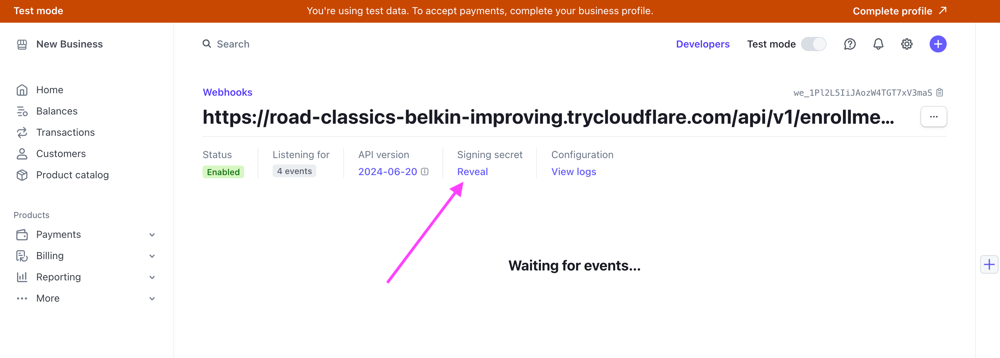

# Onboarding GPT - Get More Leads

Here we will build an Onboarding GPT Sophia that can Onboard Students.

### Business Value

Get More Leads:

1. Register and Verifies Users
2. Enroll in the Program and 1st Quarter
3. Collect Payment using Stripe

- [Preview Demo Chat](https://chatgpt.com/share/7ae37c95-967a-4d0a-9f20-d3fa3c804dc6)

**[Talk to Sophia Now](https://chatgpt.com/g/g-pOrjxdwm5-sarah-onboarding-staff)**

## Visualize How Sophia Works:

We will build the core part of (Sophia GPT) here:

### Sophia GPT Actions Flow


## Development Steps

1. Clone/Download the Repo and open `action-code` folder in VS Code.

2. Now in VS-Code `onboarding-service` folder their's a .env.example file. Rename it to .env

3. Now let's setup the environment variables. 

- We will use Gmail Service for these Variables:

  - SMTP_USER
  - SMTP_PASSWORD

- ONBOARDING_SERVER_URL=

- Stripe will be setup for Payment Gateway:
  - STRIPE_SECRET_KEY
  - STRIPE_WEBHOOK_SECRET

Follow each of the following A, B, C to complete this setup.

### A. GET - Email Service Variables:

We will be using Gmail Service. Follow these steps to get your SMTP_PASSWORD.

1. Open Your [Google Account](https://myaccount.google.com/security)

2. Enable 2-Step Verification: In the Security Tab `How you sign in to Google` section Setup 2-Step Verification. Skip if you already have setup it!

3. [Create your Google App Password](https://myaccount.google.com/apppasswords). 

**NOTE: DO NOT SHARE IT WITH ANYONE or Accidentally Push on Github. This is the most important information and should be kept confidential.**
https://support.google.com/mail/answer/185833?hl=en

Now in .env add these values:

- SMTP_USER: your_google_email
- SMTP_PASSWORD: your_g_app_password

### B. RUN - action-code

Run Docker Engine (open docker app) and in the terminal open the action-code folder. Now run the command:

`docker compose up`

Copy the CloudFlared URL from logs - it will be similar to:

```
--------------------------------+
cloudflared-1           | 2024-06-16T17:55:13Z INF |  Your quick Tunnel has been created! Visit it at (it may take some time to be reachable):  |
cloudflared-1           | 2024-06-16T17:55:13Z INF |  https://walt-roll-protecting-silly.trycloudflare.com                                      |
cloudflared-1           | 2024-06-16T17:55:13Z INF +--------------------------------------------------------------------------------------------+
```

3. Add ONBOARDING_SERVER_URL Variable

Now in .env file add this copied https cloudflared url to ONBOARDING_SERVER_URL and restart the fastapi server.

To restart the server go to app/main.py lifespan function line:16 add your name. i.e: `logger.info("Junaid is Starting the Onboarding Service")`

4. Open the URL is browser - visit /docs and tryout the endpoints

### C - Stripe Credentials:

We will be using Stripe as your Payment Gateway - wait but can I signup from Pakistan. Yeah it works perfectly fine in test mode and that's what we need :)

- [Sign up at Stripe](https://dashboard.stripe.com/register) (Select US as Country as Pakistan is missing in list)
- In the Nav Bar click on Developers Button.
- Get the Secret Key and add as value to STRIPE_SECRET_KEY variable


Nex to API Keys tab there's a Webhooks Tab. Create a New Webhook or click on Add endpoint. In WebHook you will have to pass the following

- Endpoint URL: <YOUR_UNIQUE_CLOUDFLARE_URL>/api/v1/enrollments/webhook
- Select events to listen to: checkout


- **Now Copy the WebHook Secret and Add to your .env file.**




In main.py lifespan function add anything to logging(print) statement to restart server and load env vars.

And you are all setup. It's time to Create your Own Custom GPT. 

Here are the Sarah Staff GPT config details:

[Sarah GPT Config Guide](./gpt-config.md)
