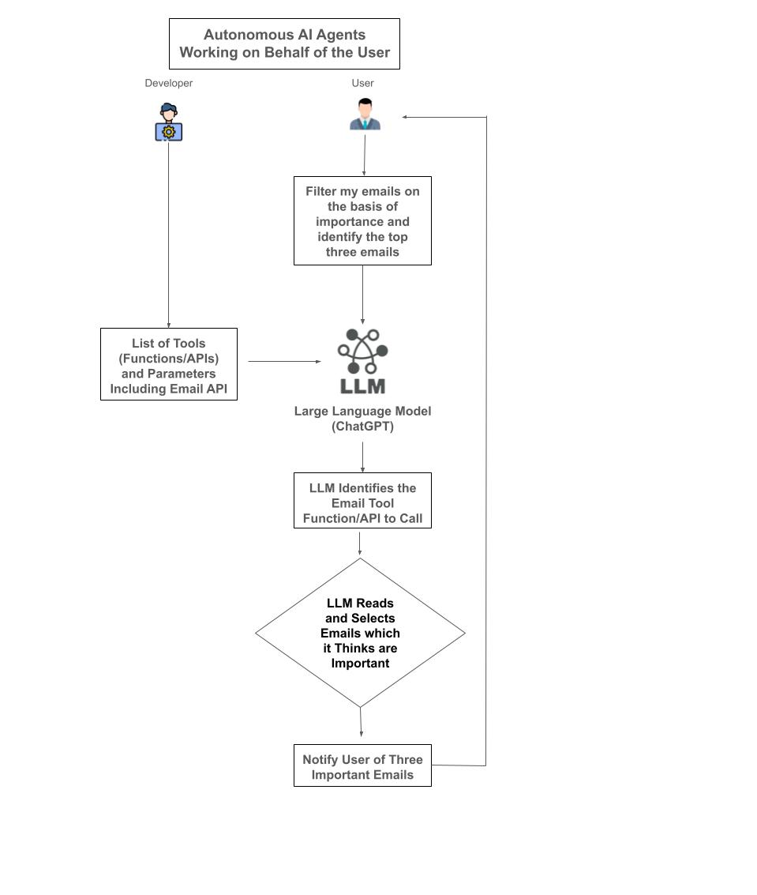

# Define AI Agents (Software, Robots, and [Humanoids](https://en.wikipedia.org/wiki/Humanoid))

In the context of artificial intelligence, *AI agents* are software entities (or, in some specialized cases, embodied systems like robots and Humanoids) designed to perceive their environment, reason about what they observe, and execute actions to achieve specific goals. They typically operate autonomously, continually processing incoming information, updating their internal models of the world, and selecting behaviors in a goal-directed manner.

Key characteristics of AI agents often include:

1. **Autonomy:** They can function without direct human intervention, making decisions and taking actions on their own after initial setup or instruction.

2. **Perception and Sensing:** Through various input channels—such as data from sensors, structured databases, natural language text, images, audio, or user input—AI agents gather information about their surroundings or domain of interest.

3. **State Representation and Modeling:** They maintain an internal representation of the state of their environment, which can include knowledge about current conditions, learned facts, or inferred relationships. This model helps them understand context, predict future states, and reason about potential outcomes of their actions.

4. **Decision-Making and Reasoning:** They apply cognitive functions—ranging from simple rule-based logic to complex machine learning models—to make informed choices. Some agents use predefined logical inference engines, while others rely on advanced techniques like reinforcement learning or deep learning.

5. **Goal-Directed Behavior:** AI agents typically work toward achieving defined objectives or completing tasks. These goals might be as straightforward as finding the shortest path between two points or as complex as maintaining operational efficiency in a multi-step industrial process.

6. **Action Selection and Execution:** Once an agent decides on a course of action, it must be capable of carrying it out—whether by sending commands to other software systems, changing data structures, controlling actuators in a physical setting, or communicating with other agents or humans.

7. **Adaptation and Learning:** Many AI agents are designed to improve their performance over time. By learning from experience—adjusting their strategies or models based on successes and failures—they can become more efficient, robust, and accurate.

In essence, an AI agent can be thought of as an intelligent “problem-solver” that interacts with its environment to make beneficial changes or gather necessary information. Such agents are fundamental building blocks in fields like robotics, virtual assistants, autonomous vehicles, recommendation systems, and complex simulation environments.

**Example of a Autonomous Agent Working on the Behalf of a User**

**Detailed Explanation:**

1. **User Initiation:**  
   The process starts when the user issues a request: *“Filter my emails by importance and notify me of the top 3 most important emails.”* This is a command the user wants the system to carry out without requiring them to manually check their mailbox.

2. **LLM Interpretation:**  
   The Large Language Model (e.g., ChatGPT) receives the user’s request. It understands that the user wants their emails to be prioritized, filtered, and the most critical messages surfaced. The LLM’s role here is both to comprehend the request and plan the necessary steps to fulfill it.

3. **Identifying External Actions:**  
   To carry out the request, the LLM determines it needs to access the user’s emails. This requires connecting to an external email API or a function that can retrieve the user’s email data. The LLM infers the parameters needed (such as authentication tokens, email address, filtering criteria) to call this external service.

4. **Autonomous Decision Step:**  
   At this point, the LLM acts autonomously on behalf of the user (assuming prior permissions have been granted and any necessary security steps—like OAuth tokens—are already in place). Instead of asking for confirmation each time, the LLM is now empowered to act. This “Decision Step” might be a logical checkpoint the system uses to confirm it can proceed without direct user input.

5. **Retrieval from Email Service:**  
   The LLM invokes the external email service’s API, retrieving the user’s emails. This data might include message metadata, timestamps, senders, subject lines, and message bodies.

6. **Processing and Ranking Emails:**  
   With the email data in hand, the LLM applies importance criteria. Importance could be derived from:
   - **Sender priority:** Emails from certain known contacts or VIP senders rank higher.
   - **Keyword detection:** Messages containing urgent terms like “ASAP,” “urgent,” “deadline,” or from known critical projects.
   - **Machine learning models:** Perhaps the system is trained on user behavior over time to know which messages are typically most relevant.

   The LLM filters out spam, low-priority newsletters, or unimportant updates, then scores each email to determine which are the top 5 in importance.

7. **Summarizing and Reporting to the User:**  
   Once the top 5 emails are identified, the LLM composes a concise summary. For example, it might say something like:  
   *“Here are the 5 most important emails you received today:  
   1. Project deadline update from Jane Doe.  
   2. Invoice due reminder from Finance Dept.  
   ...”*

   This is then presented to the user in a friendly, easily digestible format.

8. **User Notification:**  
   Finally, the user receives the LLM’s notification containing their top 3 important emails. The user has effectively delegated the decision-making and triage process entirely to the AI agent, which acted autonomously to handle the user’s request, connect to services, apply logic, and deliver a result.

---

In summary, this scenario depicts an autonomous agent operating inside or via an LLM that not only understands a user’s instruction but also independently executes a multi-step process—connecting to external APIs, making decisions, filtering, and reporting results—without needing continuous user intervention.