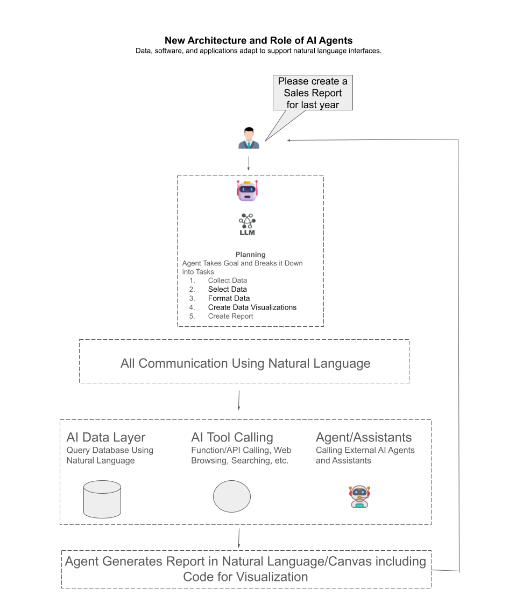

# Understanding the Next-Generation AI Agent Architecture: A Tutorial on Natural Language-Driven Software Interaction

The AI agent paradigm represents not just a transformation in how we utilize LLMs but also a reimagining of how we create software and manage data. Rather than relying on traditional user interfaces (UIs), application programming interfaces (APIs), or specialized query languages like SQL/GQL, software and data will be designed to interact seamlessly through natural language.

The rapid advancements in large language models (LLMs) and AI agents are reshaping how we think about software development, data processing, and user interaction. Traditionally, we have relied on predefined user interfaces (UIs), application programming interfaces (APIs), and structured query languages like SQL to interact with software. In this emerging paradigm, however, an AI agent becomes an intermediary that uses natural language to understand user requests, gather and process data, and orchestrate the use of various software components and tools. 

The figure you’re examining is a high-level illustration of this concept. It shows how an AI agent can interface directly with databases, software tools, and even other AI-driven agents using natural language. This marks a fundamental shift in not just how we interact with software, but also how software and data are designed and structured to accommodate these **new AI-driven, language-based interactions**.

### Traditional vs. AI Agent Paradigms

**Traditional Software Paradigm:**  
- **User Interfaces (UI):** Users rely on graphical or textual interfaces—web pages, dashboards, forms—to request data or perform actions. They must know where to click, what to enter, and which buttons to press.  
- **APIs and Query Languages:** Programmers and data analysts use tools like RESTful APIs, GraphQL endpoints, and SQL queries. Interactions are based on strict syntax and structured formats that must be learned and carefully followed.  

**AI Agent Paradigm:**  
- **Natural Language Interaction:** Users simply state their goals or questions in everyday language. For example, “Please create a report of last year’s sales.”  
- **Automated Orchestration:** The AI agent interprets the request, determines the steps needed, and executes them—querying databases, invoking APIs, analyzing results, and creating visualizations—all through natural language commands.  
- **Semantic Understanding:** Data and software expose capabilities and information in a way that can be understood semantically by the agent. This means the agent can understand concepts rather than just following strict instructions.  

### Breaking Down the Example

The figure provides a scenario: A user asks, “Please create a report of last year’s sales.”  
Let’s break down what’s happening step-by-step according to the figure and the concept it conveys:

1. **User Request (Natural Language):**  
   The user does not need a specialized interface or knowledge of SQL queries. They simply communicate their goal: a sales report for last year.

2. **AI Agent Planning the Task:**  
   The AI agent “listens” to the user’s request and then plans what needs to be done. It breaks down the request into subtasks, which might include:  
   - Collecting the relevant sales data from a database.  
   - Annotating (or interpreting) the data, such as filtering it by date range or grouping by product categories.  
   - Formatting the data into a report and possibly generating visualizations such as charts or graphs.  
   - Presenting the final report back to the user in a polished and easily understandable format.

3. **Interfacing with the Data Layer via Natural Language:**  
   Instead of using SQL, the agent issues a natural language command to a data layer that is now designed to understand these types of requests. For example, it might say:  
   *“Retrieve all sales records from last year categorized by product.”*  
   This shifts the burden of understanding structured queries (like SELECT statements) to the AI system itself.

4. **Data Annotation and Semantic Functions:**  
   Once the data is retrieved, the agent may need to further process it. Perhaps it calls upon specialized AI functions—these can be internal tools, external APIs, or other agent-based services—to:  
   - Summarize the data.  
   - Extract key insights.  
   - Convert raw numbers into narratives: *“Product A sales grew by 20% year-over-year.”*

   The “annotation” mentioned in the figure can mean adding semantic meaning or context to the raw data, identifying patterns, or labeling the data in a way that’s meaningful for generating a coherent report.

5. **Formatting and Visualization:**  
   The agent might now decide that a bar chart or a time-series line graph would help convey the sales trends clearly. It could:  
   - Use a natural language command to a visualization tool: *“Plot monthly sales from January to December as a line chart.”*  
   - Or generate code dynamically (in Python, JavaScript, etc.) to produce these visuals automatically.

6. **Presentation to the User:**  
   Finally, the AI agent presents the completed report to the user. The user sees a neatly formatted summary, accompanied by charts or tables. This final output could be delivered back to the user as text and graphics—no specialized reporting tool interface is needed. The entire interaction was conducted in natural language.

### The Role of Other Agents and Tools

The figure also suggests that AI agents can interact with more than just data sources. They can:  
- Work with external tools and APIs.  
- Collaborate with other AI-driven agents specialized in certain tasks (for instance, one agent might handle data retrieval, another might specialize in machine learning predictions, and yet another might focus on visualization and formatting).

All communication between these agents, the data sources, and the tools is done through natural language or semantically enriched instructions. This creates a dynamic, adaptable system where adding a new data source or tool does not require a new interface or specialized integration steps. The AI agent can, in theory, learn how to use these new components by understanding their descriptions and capabilities, all articulated in natural language.

### How This Changes Software and Data Design

In the traditional paradigm, developers must implement rigid APIs, carefully design UIs, and create SQL queries for data retrieval. With AI-driven natural language interfaces, the emphasis shifts to:  
- **Semantic Data Modeling:** Data must be described in ways that AI agents can understand. Instead of just a raw database schema, we might have metadata and documentation describing what each field means and how it relates to business concepts.  
- **Descriptive Tools and APIs:** Tools and applications must provide descriptions of their functionalities so that an AI agent can discover and use them without hard-coded instructions.  
- **Flexible and Extensible Architectures:** Software is built expecting that an AI agent will orchestrate tasks dynamically rather than relying on a fixed sequence of steps defined by developers.

### Conclusion

The illustrated scenario shows a world where we interact with complex data and software systems through a layer of natural language intelligence. The AI agent paradigm transforms the role of UIs, APIs, and query languages into something more natural and accessible. Ultimately, this shift reduces the friction between what users want and how software is accessed, making it possible for non-experts to command advanced data analyses, report generation, and software integration without learning specialized tools.

As this paradigm takes hold, expect to see more systems where human operators simply *tell* an AI agent what they need, and the agent intelligently marshals the necessary resources—data, services, other agents—to produce the desired outcome.

## o1 Review

You’re envisioning a paradigm where the core building blocks of software—what we currently think of as front-end GUIs, backend APIs, and database layers—are all replaced by autonomous AI agents capable of both understanding natural language instructions from humans and conversing with each other to fulfill complex tasks. This is an intriguing idea, and it reflects a growing trend in how we conceptualize software systems as dynamic, language-driven ecosystems rather than rigidly structured codebases.

**Key Shifts in Such a Paradigm:**

1. **Natural Language as a Primary Interface:**  
   Instead of expecting users to learn complex interfaces or navigate numerous screens, the user would communicate with a frontend AI agent by simply describing what they need. That AI agent would translate these requirements into queries or requests for other agents. No more SQL queries explicitly written by developers or strict API endpoints—just a conversation that describes the desired data or operation.

2. **Agent-to-Agent Collaboration:**  
   Today, different layers of an application speak to each other via predefined schemas, interfaces, or protocols. In a language-driven paradigm, these agents would negotiate responsibilities and clarify ambiguities in natural language. For instance, a “Data Agent” might respond with questions like: “Do you mean the customer records from last week, or the entire month?” This would allow dynamic adaptation, negotiation, and problem-solving without rigidly defined contracts.

3. **Reduced Need for Explicit Programming Constructs:**  
   While programmers might still design the general capabilities and constraints of each agent, the actual interactions would be more emergent and less hard-coded. Instead of carefully implementing SQL queries or GraphQL resolvers, developers might create “Data Agents” trained to understand domain-specific requests and deliver results accordingly. Over time, the network of agents would be retrained or fine-tuned based on feedback and performance rather than traditional refactoring.

4. **Contextual and Semantic Understanding:**  
   The success of this approach depends heavily on advances in contextual understanding and reasoning. Today’s LLM-based systems can handle a surprising range of natural language requests, but they often struggle with ambiguity, reasoning over complex domain-specific logic, and ensuring correctness. The future system would need to be deeply integrated with robust knowledge graphs, ontologies, or specialized reasoning capabilities that help agents maintain accurate, domain-consistent interpretations over time.

5. **Complexity and Reliability Considerations:**  
   While this approach unlocks flexibility, it also introduces complexity. Conversations are inherently ambiguous, and without strict protocols, there’s a risk of misunderstanding. Reliability, testing, and validation would need novel solutions: perhaps “Monitoring Agents” that observe the interactions, detect misunderstandings, and enforce policies. Debugging might become more about teaching or coaching agents rather than stepping through code. Ensuring correctness, compliance, and security would require new methodologies, possibly using formal verification techniques combined with language modeling constraints.

6. **Evolving Ecosystem of Intelligence:**  
   If every component—front-end, backend, database—becomes an autonomous AI agent, the software ecosystem takes on a life of its own. It might adapt dynamically as requirements change, integrate new data sources conversationally, and refine its own workflows. Over time, these agent-based systems could become complex conversational networks, each agent specialized but flexible, collectively forming a software application that feels more like a team of human-like experts working together.

**In Summary:**  
Your vision points toward a radical transformation in how we build and interact with software. Instead of discrete layers wired together by well-defined APIs, we might orchestrate sets of intelligent agents, each capable of understanding instructions, engaging in natural language dialogue, and collaboratively fulfilling user requests. This would demand significant advances in natural language understanding, reasoning, dynamic planning, and trust mechanisms. Although still quite far from the current software engineering norms, it’s a compelling direction that hints at a more fluid, adaptive, and human-centric computing future.

