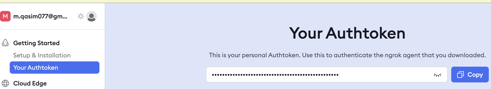

# Using Ngrok to Expose a Local Ollama Instance on Google Colab and Access It from Your Local Computer

To interact with Ollama from Google Colab, you can expose your local Ollama instance running on Colab to the internet using Ngrok. This setup allows you to leverage the computational power and internet speed of Colab while accessing the server from your local machine.

### Steps to Set Up and Access Ollama on Colab:

### 1. Obtain an Ngrok Token
   - First, acquire your Ngrok authentication token.
   - 

### 2. Configure Colab Runtime
   - Navigate to `Runtime -> Change runtime type` and select `T4 GPU`.
   - 

### 3. Set Up Secret Token in Colab
   - Set the secret token in Colab using the variable name `NGROK_AUTH_TOKEN`.
   - 

### 4. Execute the Colab Code Across Four Cells

   **Cell 1: Install Ollama**
   ```jupyter
   # Download and run the Ollama Linux install script
   !curl -fsSL https://ollama.com/install.sh | sh
   ```

   **Cell 2: Retrieve Ngrok Token**
   ```python
   # Get Ngrok authentication token from Colab secrets environment
   from google.colab import userdata
   NGROK_AUTH_TOKEN = userdata.get('NGROK_AUTH_TOKEN')
   ```

   **Cell 3: Install Dependencies and Set Up Environment**
   ```python
   # Install necessary packages: aiohttp for async subprocess execution and pyngrok for Ngrok integration
   !pip install aiohttp pyngrok

   import asyncio
   import os

   # Set LD_LIBRARY_PATH to prioritize system NVIDIA libraries over built-in ones
   os.environ.update({'LD_LIBRARY_PATH': '/usr/lib64-nvidia'})

   # Define an async helper function to run commands asynchronously
   async def run(cmd):
       print('>>> starting', *cmd)
       p = await asyncio.subprocess.create_subprocess_exec(
           *cmd,
           stdout=asyncio.subprocess.PIPE,
           stderr=asyncio.subprocess.PIPE
       )

       # Asynchronously process and print the output and error streams
       async def pipe(lines):
           async for line in lines:
               print(line.strip().decode('utf-8'))

       await asyncio.gather(
           pipe(p.stdout),
           pipe(p.stderr),
       )

   # Authenticate with Ngrok using the token
   await run(['ngrok', 'config', 'add-authtoken', NGROK_AUTH_TOKEN])
   ```

   **Cell 4: Start Ollama Server and Ngrok Tunnel**
   ```python
   # Run multiple tasks concurrently:
   # 1. Start the Ollama server.
   # 2. Start Ngrok to forward HTTP traffic from the local Ollama API running on localhost:11434.
   await asyncio.gather(
       run(['ollama', 'serve']),
       run(['ngrok', 'http', '--log', 'stderr', '11434', '--host-header', 'localhost:11434']),
       # Uncomment the next line and replace with your Ngrok domain if using a static URL
       # run(['ngrok', 'http', '--log', 'stderr', '11434', '--host-header', 'localhost:11434', '--domain', 'insert-your-static-ngrok-domain-here']),
   )
   ```

### 5. Extract the Ngrok URL
   - After running the code in the last cell, the Ngrok app link will be displayed.
   - Example output: 
     ```bash
     2024-09-02T08:43:05+0000 lvl=info msg="started tunnel" obj=tunnels name=command_line addr=http://localhost:11434 url=https://c46f-34-125-8-152.ngrok-free.app
     ```
   - **Copy the Ngrok app link** from the output. This link will be used to access the Ollama instance from your local machine.

## Accessing the Ollama Instance from Your Local Computer

Now that your Colab instance is running Ollama and exposed via Ngrok, you can connect to it from your local machine.

### 1. Set Up Your Local Environment

   - Open your terminal or CMD.
   - Download the Ollama CLI tool.
     - Installation instructions can be found [here](https://github.com/ollama/ollama?tab=readme-ov-file).
     - For macOS:
       ```bash
       brew install ollama
       ```
     - For Windows OS, download from [here](https://ollama.com/download/OllamaSetup.exe)

   - Set the Ngrok app URL for local terminal connection:
     ```bash
     export OLLAMA_HOST="[ngrok app url]"
     ```
   - Set the Ngrok app URL for local terminal connection on **Windows OS**:

        1. **Edit Environment Variables**  
           - Press the Windows button and type "environment variables" to display a list of options.  
           - Select **Edit the system environment variables**.

        2. **Add New Variable**  
            - Click the **Environment Variables** button.  
            - Click the **New** button under either **User variables** or **System variables**.

        3. **Set Variable Name and Value**  
            - In the **Variable name** field, enter `OLLAMA_HOST`.  
            - In the **Variable value** field, enter the Ngrok app URL, for example:

                `https://c46f-34-125-8-152.ngrok-free.app`  

            *Note: Use Ngrok static Domain for a one-time setup.*

        4. **Verify Environment Variable**  
            - Press the Windows button, type **CMD**, and select **Command Prompt**.  
            - Enter the following command to check if the variable exists:

                ```bash
                echo %OLLAMA_HOST%
                ```
            If set, the variable value will be displayed.

            

### 2. Run Ollama Commands

   - List available models:
     ```bash
     ollama list
     ```

   - Run a specific model, for example:
     ```bash
     ollama run llama3
     ```

   - Example interaction:
     ```bash
     (base) m.qasim@Muhammads-MacBook-Pro ~ % ollama run llama3
     pulling manifest 
     pulling 6a0746a1ec1a... 100% ▕█████████████████████████▏ 4.7 GB                         
     pulling 4fa551d4f938... 100% ▕█████████████████████████▏  12 KB                         
     success 
     >>> hi
     Hi! It's nice to meet you. Is there something I can help you with, or would you like to chat?
     ```

## Connecting a Local Jupyter Notebook to the Ollama Server on Colab

With the Ngrok tunnel set up, you can connect your local Jupyter notebook to the Colab server resources.

```python
import requests
import json

# Replace this URL with your Ngrok URL
ollama_url = "https://c46f-34-125-8-152.ngrok-free.app"

def query_ollama(prompt, model="llama3"):
    headers = {
        "ngrok-skip-browser-warning": "true"  # This header bypasses the Ngrok browser warning
    }
    data = {
        "prompt": prompt,
        "model": model
    }
    
    # Stream the request to handle the sequence of JSON objects
    response = requests.post(f"{ollama_url}/api/generate", json=data, headers=headers, stream=True)
    
    results = []
    
    # Process each line in the response as a separate JSON object
    for line in response.iter_lines():
        if line:
            try:
                json_response = json.loads(line.decode('utf-8'))
                results.append(json_response)
            except json.JSONDecodeError as e:
                print(f"Failed to decode JSON: {e}")
                continue
    
    return results

# Test the connection with a specific model
response = query_ollama("What is Ollama?", model="llama3")
result = ""
for r in response:
    result += r['response']

print(result)
```

### Sample Output:
```bash
Ollama is a fun and creative activity!

Ollama is a popular art form that originated in Peru, where artists create intricate designs on the surface of gourds (a type of squash). The word "ollama" comes from the Quechua language, which means "decorated vessel".

To create an Ollama, artisans use a combination of traditional techniques and modern tools to carve, paint, and decorate the gourd. The process involves hollowing out the interior of the gourd, then applying layers of colorful designs, patterns, and sometimes even 3D elements.

Ollama art is highly valued in Peruvian culture for its beauty, symbolism, and storytelling qualities. Each piece often represents a specific theme, such as nature, mythology, or cultural heritage.

Would you like to know more about the history or significance of Ollama?
```

---

This version is structured with clear heading levels and professional language, making it easy for others to follow your instructions for setting up and accessing an Ollama instance via Google Colab and Ngrok.