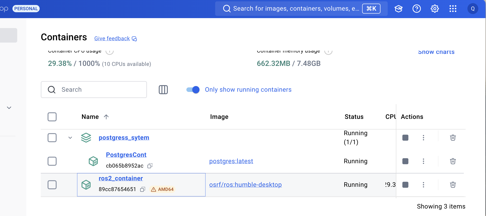

### **Prerequisites**

1. **macOS Version**: Ensure you're running macOS Mojave (10.14) or later.
2. **Docker Desktop for Mac**: Install from [Docker's official website](https://www.docker.com/products/docker-desktop).

   - After installation, make sure Docker is running. You should see the Docker icon in your menu bar.

---

### **Step 1: Verify Docker Installation**

Open your terminal and run:

```bash
docker --version
```

You should see something like:

```
Docker version 20.10.8, build 3967b7d
```

---

### **Step 2: Pull a ROS 2 Docker Image**

Pull the official ROS 2 Docker image from Docker Hub. For this example, we'll use the ROS 2 Humble Hawksbill image.

```bash
docker pull osrf/ros:humble-desktop
```

This image includes the desktop version of ROS 2 Humble.

---

### **Step 3: Run a Docker Container**

Run a Docker container with the ROS 2 image. We'll also mount your current directory into the container to easily share files.

```bash
docker run -it --rm \
  --name ros2_container \
  osrf/ros:humble-desktop \
  bash
```


Explanation:

- `-it`: Runs the container in interactive mode.
- `--rm`: Automatically removes the container when it exits.
- `--name ros2_container`: Names the container for easy reference.
- `osrf/ros:humble-desktop`: Specifies the image to use.
- `bash`: Starts a Bash shell inside the container.

---

### **Step 4: Create a "Hello World" ROS 2 Package Inside the Container**

#### **Initialize ROS 2 Environment**

Inside the container, source the ROS 2 setup script:

```bash
source /opt/ros/humble/setup.bash
```

#### **Create a Workspace**

```bash
mkdir -p ~/ros2_ws/src
cd ~/ros2_ws
```

#### **Create a Package**

```bash
cd src
ros2 pkg create --build-type ament_python my_python_pkg
```

#### **Write the "Hello World" Node**

Navigate to the package directory:

```bash
cd my_python_pkg/my_python_pkg
```

Create the `hello_world.py` script:

```bash
touch hello_world.py
chmod +x hello_world.py
```

Edit `hello_world.py` using a text editor like `nano`:

```bash
nano hello_world.py
```

Add the following code:

```python
#!/usr/bin/env python3

import rclpy
from rclpy.node import Node

class HelloWorldNode(Node):
    def __init__(self):
        super().__init__('hello_world_node')
        self.get_logger().info('Hello, world from ROS 2 in Docker!')

def main(args=None):
    rclpy.init(args=args)
    node = HelloWorldNode()
    rclpy.spin(node)
    node.destroy_node()
    rclpy.shutdown()

if __name__ == '__main__':
    main()
```

Save and exit the editor (`Ctrl+O`, `Enter`, `Ctrl+X` in `nano`).

#### **Update the Setup Files**

Edit `setup.py` located in `~/ros2_ws/src/my_python_pkg/setup.py`:

```bash
nano ~/ros2_ws/src/my_python_pkg/setup.py
```

Modify it to include the script entry point:

```python
from setuptools import setup

package_name = 'my_python_pkg'

setup(
    name=package_name,
    version='0.0.0',
    packages=[package_name],
    py_modules=['my_python_pkg.hello_world'],
    data_files=[
        ('share/' + package_name, ['package.xml']),
    ],
    install_requires=['setuptools'],
    zip_safe=True,
    author='Your Name',
    author_email='your.email@example.com',
    description='A simple "Hello World" ROS 2 package in Docker',
    license='Apache License 2.0',
    entry_points={
        'console_scripts': [
            'hello_world = my_python_pkg.hello_world:main',
        ],
    },
)
```

Save and exit the editor.

---

### **Step 5: Build the Package**

Return to the workspace root and build:

```bash
cd ~/ros2_ws
rosdep install -i --from-path src --rosdistro humble -y
colcon build
```

Source the setup script:

```bash
source install/setup.bash
```

---

### **Step 6: Run the "Hello World" Node**

Run the node:

```bash
ros2 run my_python_pkg hello_world
```

You should see the output:

```
[INFO] [hello_world_node]: Hello, world from ROS 2 in Docker!
```

---

### **Step 7: Exiting the Docker Container**

When you're done, you can exit the container:

```bash
exit
```


Since we used the `--rm` flag, the container will be removed automatically upon exit.

---

### **Optional: Sharing Files Between macOS and Docker Container**

If you want to edit files on your macOS host and have them available in the Docker container, you can mount a volume.

#### **Step 1: Create a Workspace on Host**

On your macOS terminal, create a workspace:

```bash
mkdir -p ~/ros2_docker_ws/src
```

#### **Step 2: Run Docker with Volume Mount**

Run the Docker container and mount the workspace:

```bash
docker run -it --rm \
  --name ros2_container \
  -v ~/ros2_docker_ws:/root/ros2_ws \
  osrf/ros:humble-desktop \
  bash
```

Now, any changes you make in `~/ros2_docker_ws` on your host will be reflected inside the container at `/root/ros2_ws`.

---

### **Troubleshooting**

- **Docker Permission Issues**: If you encounter permission issues with mounting volumes, ensure Docker has access to your folders. Check Docker Desktop settings under **Resources > File Sharing**.

- **ROS 2 Commands Not Found**: Make sure to source the ROS 2 setup script inside the container:

  ```bash
  source /opt/ros/humble/setup.bash
  ```

- **Build Errors**: Ensure all dependencies are installed and up to date. Use `rosdep` to install missing dependencies.

---

### **Advantages of Using Docker for ROS 2**

- **Consistency**: Docker provides a consistent environment across different machines.
- **Simplicity**: Avoids the need to install and configure ROS 2 directly on macOS.
- **Isolation**: Keeps your ROS 2 environment isolated from your host system.

---

### **Conclusion**

Using Docker to run ROS 2 on macOS simplifies the setup process and allows you to get started quickly. You can develop and test ROS 2 applications in a Linux environment without leaving your macOS system.

---

**References:**

- [Official ROS Docker Images](https://hub.docker.com/_/ros)
- [Docker Desktop for Mac](https://docs.docker.com/desktop/install/mac-install/)
- [ROS 2 Documentation](https://docs.ros.org/en/rolling/index.html)
