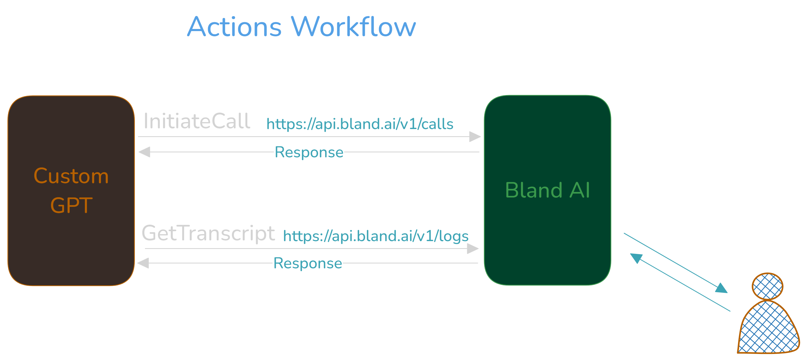

# Marriage Bureau Calling Assistant

Our business operates a Marriage Bureau where customers register their profiles. When a potential match is identified, our Custom GPT, named "Marriage Bureau Calling Assistant," will use the Bland AI phone calling agent service to make phone calls to inform customers about their potential matches.

This integration enhances the efficiency of our match notification process, ensuring timely and personalized communication with our customers. 

We will create a Custom GPT named "Marriage Bureau Calling Assistant" and utilize the [Bland AI](https://www.bland.ai/) phone calling agent service within our Custom GPT action.

But before creating, let's know a bit about Bland AI Phone Calling service.

## 1. Introduction to Bland AI

Bland AI is a sophisticated platform designed to create AI-powered phone calling agents. It offers automated solutions for routine phone calls across various sectors, including healthcare, customer service, sales, and appointment scheduling. The platform's core capabilities include advanced speech recognition, natural language processing, and text-to-speech functionality, enabling it to conduct conversations, follow instructions, and provide assistance in a natural and engaging manner.

Bland AI employs a proprietary transformer-based model, which has been fine-tuned on a vast dataset of phone call conversations. This ensures that the AI can handle a wide range of interactions with high accuracy. Additionally, Bland AI uses custom infrastructure to ensure low-latency responses and high reliability, making it ideal for real-time applications.

## 2. Use Cases of Bland AI
- Inbound phone calls
- Outbound phone calls
- Call center agents
- Customer service agents
- Receptionists 
and much more. Do check out the offical website of [Bland AI](https://www.bland.ai/) for more details.

## 3. Steps to create our Marriage Bureau Calling Assistant with Bland AI.

1. Create account at [Bland AI](https://www.bland.ai/).

    *Upon Signup, Bland AI provides $2 free credits.*

2. Go to GPT Builder and create a new GPT. Give your GPT a name and description.

3. Click on "Create new action". We will integrate Bland AI APIs in our custom GPT actions. But before that, we must know 
    - Bland AI provides APIs to send a call. We can integrate and use these APIs in our applications.
    - Refer to the [Example](https://app.bland.ai/dashboard?page=send-call) for Send Call API.
    - In our specific use case, we just want to integrate Bland AI `Send Call` API in our Custom GPT action. Custom GPT Actions require "OpenAPI Schema". So we have to create the schema from this API.
    - For convenience, we have already created [Schema](./schema.json). 
    - Copy the schema and paste it in our Custom GPT action.
    - Get API Key from Bland AI and paste it in our Custom GPT action. Choose 'custom' and write 'Authorization` in the 'Custom Header Name' input field.
    

    - We have created 'InitiateCall' and 'GetTranscript' actions in our Custom GPT. `InitiateCall` will initiate a call. `GetTranscript` will get the call transcript.
    

4. Now in our last step, we will add the instructions for our Custom GPT.
    - Copy the instuctions from [instructions.txt](instructions.txt) and paste it in our Custom GPT.

5. Save the Custom GPT and publish it.

## 4. Workflow
- Refer to the Bland [AI Documentation](https://docs.bland.ai/api-v1/post/calls) for `Send Call' API. 
- Highlevel workflow of our Custom GPT.

- Our Custom GPT will send a post request on `https://api.bland.ai/v1/calls`. 
- In body, it will send p"hone number" `str` of the customer and "task" `str`.
- The "task" will be the prompt which Custom GPT will create based on the instructions provided. 
- Bland AI will handle the rest. 

## Test our "Marriage Bureau Calling Assistant" Custom GPT

- To test, write a prompt to custom GPT. 
- Copy the prompt from [example_prompt.txt](example_prompt.txt) and paste it in our Custom GPT.
- Let the magic happen !

