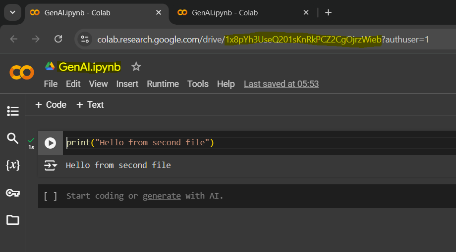

## Is google colab notebook stored on a virtual machine or a container?

Google Colab notebooks are executed on a virtual machine (VM) that runs within Google's infrastructure. Each notebook session you start is tied to a VM that can have a combination of CPU, GPU, or TPU, depending on the runtime configuration you choose.

That said, the VM likely uses containers to isolate different user sessions and environments, similar to how many cloud platforms run workloads. This containerization provides a lightweight, secure, and scalable environment for multiple users to run code simultaneously. The underlying infrastructure is a combination of both virtual machines and containers, with containers providing the necessary environment and dependencies for each Colab session.

## The file stored in addition to the notebook is on temporary basis, it seems they stored in the container and disappear after the container shuts down?

Yes, you are correct! In Google Colab, files stored during a session (in addition to the notebook itself) are saved temporarily within the environment, which is essentially a container inside the virtual machine. Once the session is terminated or the virtual machine is recycled, all files stored locally within the session's file system are deleted.

This behavior aligns with how containers work: they provide an isolated environment that gets reset after the session ends. If you want to persist files beyond a Colab session, you can:

1. **Save to Google Drive**: You can mount your Google Drive within the notebook and store files there.
2. **Download files locally**: Manually download any important files to your local machine.
3. **Use cloud storage**: You can integrate with services like AWS S3, Google Cloud Storage, etc., to save files.

This way, you can avoid losing any important data when the session ends.

## But it seems the notebook itself is also stored on the google drive so that it can be loaded from the drive to container when the next session starts?

Yes, that's exactly right! The Colab **notebook itself** (the `.ipynb` file) is stored in Google Drive, which is why it can persist across sessions and be reloaded when needed. When you open a notebook from Google Colab, it essentially pulls the notebook from your Google Drive, loads it into a container or virtual environment, and allows you to work with it.

However, **the notebook's environment** (e.g., installed libraries, variables, files you worked with, etc.) is not saved between sessions. Only the code and markdown you wrote in the notebook are stored in Google Drive. So, when you start a new session, you need to reinstall any libraries or re-load any files, unless you stored those files in Google Drive or another persistent location during the previous session.

So, in summary:

- **Notebook files (`.ipynb`)** are stored in Google Drive and can be reloaded in future sessions.
- **Other files/data and environment setups** within the session are stored temporarily and disappear after the container is shut down.

## But it seams if you mount the google drive it remains mounted when the next session starts, where does this mounting of drive stored so that it can be retrieved in the next session?

Actually, when you mount Google Drive in a Google Colab session, the mount itself is **not persistent across sessions**—the connection is lost once the session ends or the virtual machine is reset. However, it may **appear** to remain mounted if your session hasn't been completely reset yet. This gives the impression that the drive is still mounted, but it's only because the environment hasn't been fully terminated.

In reality:

- Each time a new session starts (or when the VM is recycled), you need to remount Google Drive manually.
- The reason this sometimes feels seamless is that if you keep the same session alive for an extended period or reconnect quickly, it may retain the mounted drive within the same instance of the VM.

For the mount to persist across sessions, the code to mount Google Drive must be included in the notebook and executed in each new session. Colab does not store the mount state anywhere; instead, it just maintains the session's state temporarily as long as the VM is active.

If you restart the kernel or reconnect after a significant gap, you'll find that you'll need to re-execute the mounting code like:

```python
from google.colab import drive
drive.mount('/content/drive')
```

This step will have to be redone every time the session is reset.

## How 'ipynb' files are saved at google drive, like i was testing out and have different files with same name in google drive?

The way Google Colab saves .ipynb files to Google Drive is by creating a unique identifier for each notebook and storing it within your Google Drive folder. This identifier is often a long string of characters that is part of the notebook's URL.

Here's a breakdown of how this works:

1. Notebook Creation: When you create a new notebook in Colab, it's initially stored in your Google Drive's "Colab Notebooks" folder.

2. Unique Identifier: Colab assigns a unique identifier to the notebook. This identifier is used to distinguish it from other notebooks and to link it to the corresponding data in Google Drive.

   

3. Storage: The notebook's .ipynb file is saved in your Google Drive with a filename that includes this unique identifier. For example, it might be named something like notebook_1234567890.ipynb.

   
   

4. Access: When you open the notebook in Colab, it fetches the file from your Google Drive using the unique identifier and loads it into the notebook environment.
