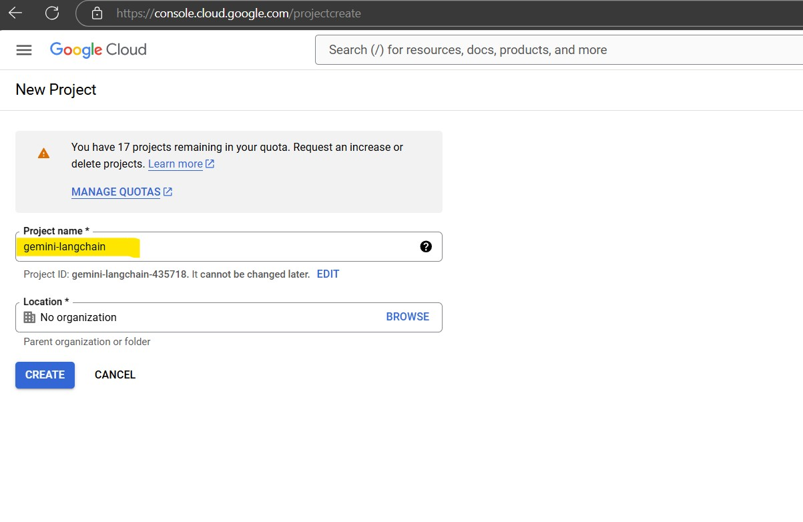
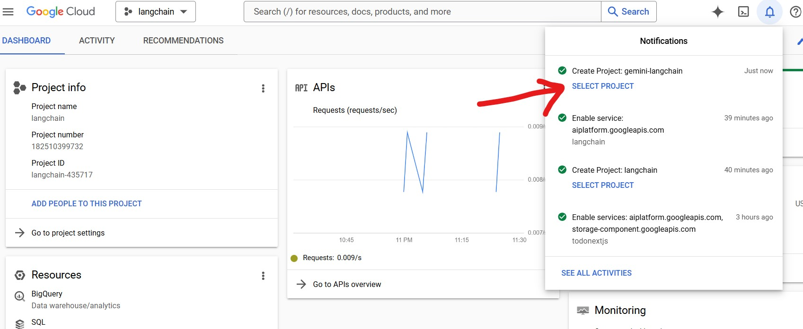
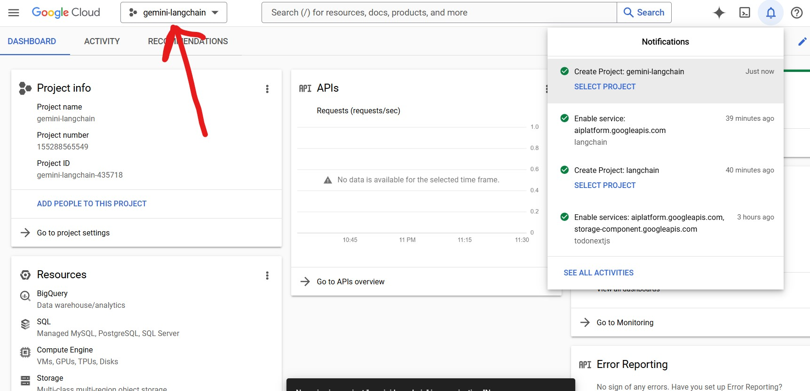
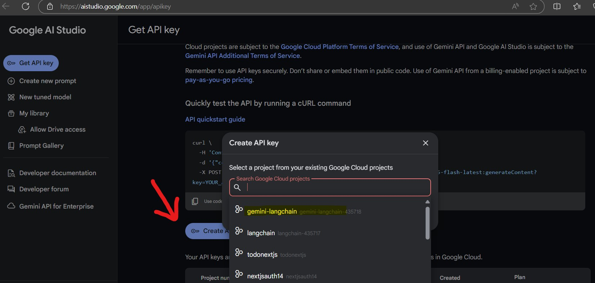
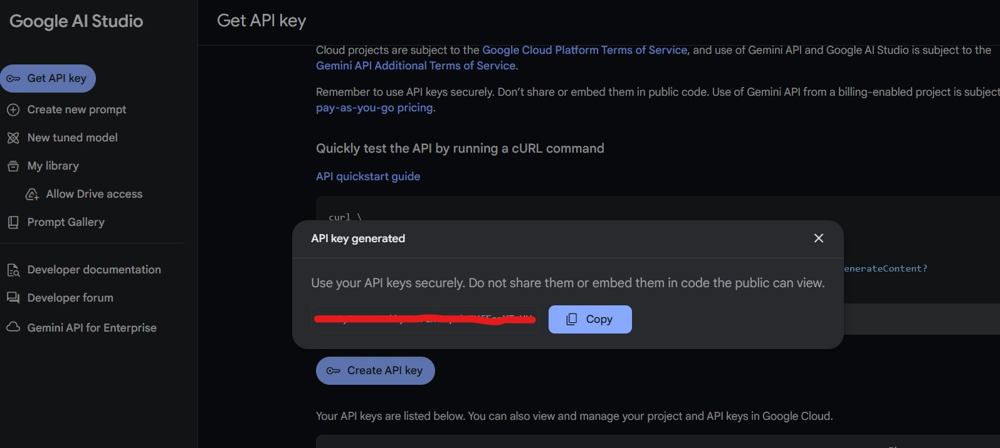

# Google Gemini API with LangChain and Google Colab:

**Prerequisites:**

- A Google Cloud Platform account with a project enabled for the Gemini API.
- A Google Colab notebook.
- Python 3.6 or later installed.
- The following Python libraries installed:
    - `langchain_core`
    - `langchain_google_genai`

**Steps:**

1. **Create a Google Colab Notebook:**
   - Open Google Colab (colab.research.google.com) and create a new notebook.

2. **Install Required Libraries:**
   - In the first cell of the notebook, run the following code to install the necessary libraries:

   ```python
   !pip install langchain_core
   !pip install langchain_google_genai
   ```

3. **Create project with Google Cloud Platform:**
   - Visit your google cloud account and create new project or use an existing one: [GOOGLE CLOUD ACCOUNT](https://console.cloud.google.com/projectcreate)

   - 
   - 
   - 


4. **Create Google API key in Google AI Studio:**
   - Visit your google AI Studio account and create API KEY : [GOOGLE AI STUDIO](https://aistudio.google.com/app/apikey)

   - 
   - 

5. **Example code:**

   ```python
   import os
   from google.colab import userdata
   from langchain_google_genai import ChatGoogleGenerativeAI

   # Replace 'YOUR_SECRET_NAME' with the actual name of your secret
   google_api_key = userdata.get('GOOGLE_API_KEY')

   llm = ChatGoogleGenerativeAI(
      api_key=google_api_key,
      model="gemini-1.5-flash",
      temperature=0.2,
   )

   print(llm.invoke("hi"))
   ```
