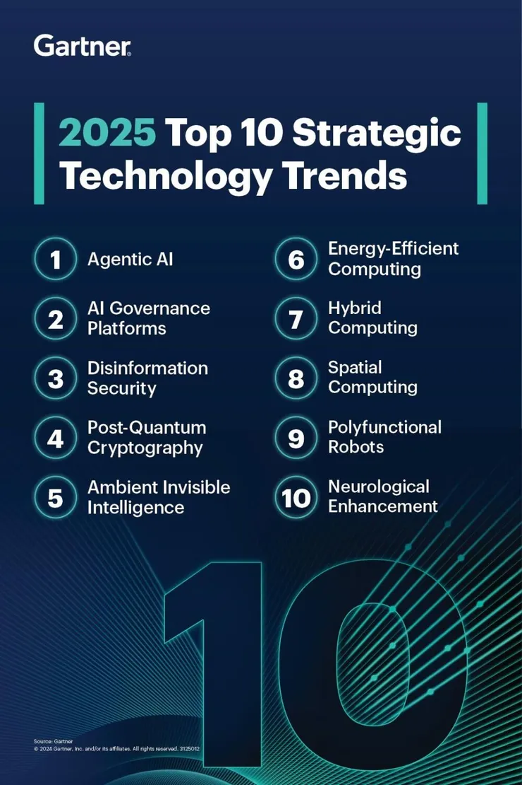

# Learn Agentic AI

This repo is part of the [Panaversity Certified Agentic and Robotic AI Engineer](https://docs.google.com/document/d/15usu1hkrrRLRjcq_3nCTT-0ljEcgiC44iSdvdqrCprk/edit?usp=sharing) program. It covers AI-201 and AI-202 courses.

### AI-201: Fundamentals of Agentic AI

Covers Chapters from -01 to 11

**[AI-201 Video Playlist](https://www.youtube.com/playlist?list=PL0vKVrkG4hWpDokw004ujFI6U_58WChPl)**

Note: These videos are for additional learning, and do not cover all the material taught in the onsite classes.

### Projects for AI-201 Students

To begin with all AI-201 students will complete these projects:

Generative AI Projects:
https://github.com/panaversity/learn-agentic-ai/tree/main/02_generative_ai_for_beginners/PROJECTS

Agentic AI Projects:
https://github.com/panaversity/learn-agentic-ai/tree/main/05_crew_ai/PROJECTS

Project Checking: Your Instructors will check your project on the due date in class. You will be removed from
the class until you successfully complete your project and submit it.

All AI-201 students will complete these projects (links included in form) and submit them in this form:
https://forms.gle/VSZaLDBwCHNPzY5Z6

Project Checking: Your Instructors will check your project on the due date in class. You will be removed from
the class until you successfully complete your project and submit it.

### AI-202: Advanced Agentic AI Engineering

Covers Chapters 12 and onwards

**[AI-202 Video Playlist](https://www.youtube.com/playlist?list=PL0vKVrkG4hWoHDg46N85-9NDhmOaPWEwA)**

Note: These videos are for additional learning, and do not cover all the material taught in the onsite classes.

Projects for AI-202 Students

All AI-202 students will complete these projects (links included in form) and submit them in this form:
https://forms.gle/Zfp2CWSmp9e91Wkk9

Project Checking: Your Instructors will check your project on the due date in class. You will be removed from
the class until you successfully complete your project and submit it.

## Additional Certification Program Material

[Program Podcast](https://youtu.be/ViRWA4wLI8k)

[Agentic AI Detailed Intro Presentation](https://bit.ly/4hTqT4G)

[Program Review by ChatGPT](https://chatgpt.com/share/6732a6f1-a3c4-8001-99cb-1b272c3b3881)

Read this article to understand [The AI agents stack](https://www.letta.com/blog/ai-agents-stack)

## Must Read and Watch: Material to Understand the Coming Agentic AI Age

[Agentic AI Explained](https://www.facebook.com/ziakhan/posts/pfbid0ee2csS99taRRps5YVYRFPBYvM6mw1mWpX21zXZz1XdMKAwTdF4Nq4TR97XrFWQktl)

[AI Agents Explained Like You're 5](https://www.youtube.com/watch?v=wazHMMaiDEA)

[The Future Is Agentic](https://www.youtube.com/watch?v=ZYf9V2fSFwU&t=1s)

[Why Vertical LLM Agents Are The New $1 Billion SaaS Opportunities](https://www.youtube.com/watch?v=eBVi_sLaYsc&t=2s)

[Vertical AI Agents Could Be 10X Bigger Than SaaS](https://www.youtube.com/watch?v=ASABxNenD_U)

[OpenAI's Path to AGI | Five Levels of Intelligence](https://www.youtube.com/watch?v=8b26p6dl2hs)

[AI Agents: Are We Ready For Machines That Make Decisions?](https://www.forbes.com/sites/charlestowersclark/2024/10/25/ai-agents-are-we-ready-for-machines-that-make-decisions/)

[Function Calling](https://chatgpt.com/c/6747f6a8-8764-8001-9997-70efb983235d)

[Generative AI’s Act o1](https://www.sequoiacap.com/article/generative-ais-act-o1/)

[Watch AGI could Double GDP](https://www.facebook.com/reel/1660606758033503)

[The INSANE Race for AI Humanoid Robots](https://www.youtube.com/watch?v=90TMZ2fq9Gs&t=3s)

